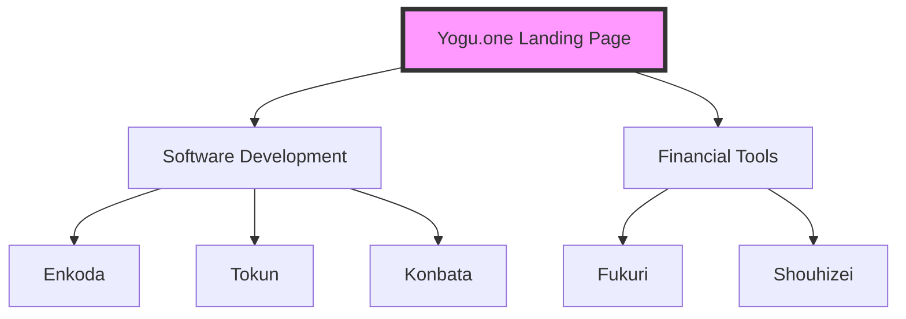

# Yogu.one

Yogu.one is the primary landing page and central hub for the Yogu.one ecosystem. It provides easy navigation to a variety of lightweight, performant, and accessible web tools hosted on specialized subdomains.

## Ecosystem Tools

### Software Development

- **[Enkoda](https://enkoda.yogu.one)**: A high-performance utility for data encoding and decoding.
- **[Tokun](https://tokun.yogu.one)**: A lightweight, privacy-focused JWT debugger for secure token analysis.
- **[Konbata](https://konbata.yogu.one/)**: A fast, privacy-focused text-data converter for JSON, YAML, and XML.

### Financial Tools

- **[Fukuri](https://fukuri.yogu.one)**: A clean and powerful compound interest calculator with regular contribution support and visual growth charts.
- **[Shouhizei](https://shouhizei.yogu.one)**: An international consumption tax (GST/VAT) calculator.

## Architecture

The following diagram illustrates the relationship between the main landing page and the various ecosystem tools hosted on subdomains:

## Project Philosophy

- **No Frameworks**: Built using pure HTML5, CSS3, and Vanilla JavaScript (ES6+).
- **Zero Build Step**: No Webpack, Vite, or npm required. The code runs directly in modern browsers.
- **Performance First**: Optimised for speed, with minimal page weight and near-instant load times.
- **Privacy Focused**: No cookies, no trackers, and no external analytics.
- **Accessibility**: Follows WCAG AA standards for high contrast and keyboard navigation.

## Development

The project uses [Deno](https://deno.land) for local development, formatting, and linting.

### Commands

- **Local Server**: `make serve` or `deno run --allow-net --allow-read serve.ts` (runs on http://localhost:8000)
- **Formatting**: `make fmt`
- **Linting**: `make lint`

## License

GPL v3. See the [LICENSE](LICENSE) file for details.
